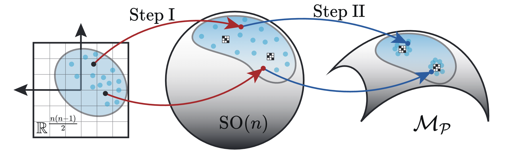

# OT4P: Unlocking Effective Orthogonal Group Path for Permutation Relaxation
The repository is a PyTorch implementation of the NeurIPS 2024 paper [OT4P: Unlocking Effective Orthogonal Group Path for Permutation Relaxation](https://neurips.cc/virtual/2024/poster/93561). The paper presents a novel differentiable transformation for relaxing permutation matrices onto the orthogonal group, namely OT4P, which enables gradient-based (stochastic) optimization of problems involving permutation matrices. 



## Requirements
Our implementation relies on [torch-linear-assignment](https://github.com/ivan-chai/torch-linear-assignment), a library that facilitates efficient batch computation of linear assignment problems on GPUs.

## Minimal example
We provide a minimal example (`example.py` or `example.ipynb`) to illustrate the use of OT4P. Given matrices $X$ and $Y = PXP^{\top}$, where $P$ is the true permutation matrix, the objective is to find the true permutation matrix $P$ using only $X$ and $Y$. This problem can be formulated as follows:

$$
\min_P \\|PXP^{\top} - Y\\|_{\mathrm{F}}^2.
$$

We use OT4P to solve this problem from three different perspectives:
1. Deterministic Optimization;
2. Stochastic Optimization;
3. Constrained Optimization.

## Citation
Please consider citing our paper as:
```
@InProceedings{guo2024ot4p,
  title = 	 {OT4P: Unlocking Effective Orthogonal Group Path for Permutation Relaxation},
  author =       {Guo, Yaming and Zhu, Chen and Zhu, Hengshu and Wu, Tieru},
  booktitle = 	 {Proceedings of 38th Annual Conference on Neural Information Processing Systems},
  year = 	 {2024}
}
```
